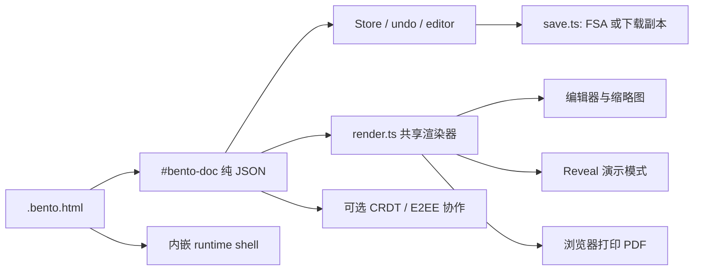

# Bento PPT 相关项目调研报告

> 结论先行：Bento 不是一个以 `.pptx` 为真源的 PPT 生成 Skill，而是一个把“文档数据、查看器、演示器、编辑器和保存逻辑”打包进单个 `.bento.html` 文件的本地优先演示文稿系统。它在浏览器内编辑、离线携带、AI JSON round-trip、交互式演示和协作方面有明显特色；但当前源码没有 PPTX 导入/导出实现，因此不能把它当成 PowerPoint 文件交付方案。对外发送时，推荐发送 PDF；把 `.bento.html` 作为可继续编辑的源文件或补充附件。

## 调研范围与证据口径

- 目标仓库：`git@github.com:SwimmingLiu/bento.git`。
- 固定源码快照：`3ad1bdf18e88cf04c79698b11a7cfc0d8570db63`，提交时间为 2026-08-01，提交信息为 `Merge pull request #135 from 7jameslondon/feature/laser-pointer`。
- 以下“事实”均来自该快照的源码、仓库文档或 GitHub Actions；“推断”是基于调用关系/实现细节的归纳；“风险/未确认”明确标出尚未由源码测试或实际浏览器矩阵验证的部分。
- GitHub 源码链接统一指向该快照，例如 [`slides/src/model.ts`](https://github.com/SwimmingLiu/bento/blob/3ad1bdf18e88cf04c79698b11a7cfc0d8570db63/slides/src/model.ts)。行号以该快照为准。

## 结论摘要

### Bento 的核心思想

传统 PPT 通常是“二进制文档 + 外部应用”；Bento 把它改成“可复制的 HTML 文件 + 内嵌 JSON 文档 + 内嵌运行时”。文件本身携带 viewer、presenter、editor、字体、图片和图表，因此接收者只需要现代浏览器即可查看或编辑，不需要安装 Bento 应用。真正持久化的是 `#bento-doc` 中的纯 JSON，DOM 只是运行时渲染结果。

### 与其他 PPT Skill 的最关键差异

1. **交付格式不同**：Bento 的第一公民是 `.bento.html`；Anthropic 官方 `pptx` Skill、Codex presentations、PptxGenJS 和 PPT Master 等方案的第一公民是原生 `.pptx`/OOXML。
2. **编辑对象不同**：Bento 编辑自己的场景图模型，支持文本、形状、图片、SVG、图表、表格、媒体、状态和动画；原生 PPTX Skill 编辑 PowerPoint 的文本框、DrawingML、母版、主题和图表对象。
3. **运行位置不同**：Bento 的编辑器和播放器随文件走，强调 local-first、offline、single-file；原生 PPTX Skill 的运行时通常是生成/修改文件的工具链，最终由 PowerPoint、Keynote、LibreOffice 或 Google Slides 打开。
4. **交付互操作性不同**：Bento 当前只确认有浏览器打印 PDF，没有确认的 PPTX writer 或 reader。这是它和成熟原生 PPTX Skill 之间最大的能力边界。

### HTML 分享的直接判断

不会因为 Bento 使用 HTML 就必然乱码或随机样式错乱。源码有 UTF-8 声明、JSON 中 `<` 转义、纯数据模型、资源内嵌机制、字体内嵌和统一渲染器；在现代浏览器中打开一个完整的 `.bento.html` 附件，文本和基本样式的风险较低。

但它存在几类明确的条件性风险：外链图片/视频/字体离线时失效，浏览器和打印设置会影响 PDF，静态文件管理器预览可能没有自定义字体，Safari/Firefox/iOS 不能原地覆盖保存，动画/交互状态不会进入 PDF，以及 `.bento.html` 不是 PowerPoint 可直接编辑的 `.pptx`。如果 HTML 被粘贴进邮件正文或聊天富文本，而不是作为原文件附件发送，第三方客户端的 HTML 清洗/重写也可能破坏页面；这是分发方式风险，不是 Bento JSON 保存逻辑本身的乱码问题。

## 1. 项目定位

### 事实

1. README 将 Bento 定位为“the office suite that fits in a file”，当前首个产品是 `bento/slides`，产品形态是一个自带 viewer、presenter、editor 的单一 HTML 文件；打开文件即进入运行时，不需要安装应用（[`README.md:L7-L23`](https://github.com/SwimmingLiu/bento/blob/3ad1bdf18e88cf04c79698b11a7cfc0d8570db63/README.md#L7-L23)）。
2. 数据放在 HTML 顶部可读 JSON 块，保存时只重写该块；README 将此描述为本地优先、File System Access API 保存并在不支持时下载副本（[`README.md:L31-L38`](https://github.com/SwimmingLiu/bento/blob/3ad1bdf18e88cf04c79698b11a7cfc0d8570db63/README.md#L31-L38)）。
3. README 宣称的 Slides 能力包括 Morph、实时协作、内置图表、AI/JSON round-trip、speaker view、交互状态、motion paths 和 PDF export；路线图中的 `spaces`、`dash`、`vault` 是后续独立 `.bento.html` 应用（[`README.md:L40-L50`](https://github.com/SwimmingLiu/bento/blob/3ad1bdf18e88cf04c79698b11a7cfc0d8570db63/README.md#L40-L50)、[`README.md:L149-L155`](https://github.com/SwimmingLiu/bento/blob/3ad1bdf18e88cf04c79698b11a7cfc0d8570db63/README.md#L149-L155)）。

### 推断

Bento 的核心竞争点不是“把传统二进制办公文件转换成网页”，而是把“文档数据 + 运行时 + 编辑器 + 播放器”作为同一个可复制、可邮件发送、可离线打开的 HTML 交付物。其可编辑性依赖内部 JSON 模型，而不是依赖浏览器 DOM 作为持久化格式。

## 2. 目录与模块架构

### 事实

仓库根目录的职责在 README 中被概括为：`slides/` 是应用，`server/sync-worker/` 是盲中继，`docs/` 与 `scripts/` 是文档和构建工具（[`README.md:L114-L128`](https://github.com/SwimmingLiu/bento/blob/3ad1bdf18e88cf04c79698b11a7cfc0d8570db63/README.md#L114-L128)）。与本调研最相关的模块如下：

| 层 | 关键路径 | 职责 |
|---|---|---|
| 应用入口 | `slides/src/main.ts` | 配置 app、注册预览、捕获 pristine shell、读取 `#bento-doc`、决定编辑器/只读播放器（`L26-L57`, `L101-L145`）。 |
| 模型 | `slides/src/model.ts` | `FORMAT`、类型定义、工厂函数、布局、`parseDoc`（`L6-L7`, `L302-L360`, `L977-L996`）。 |
| 状态 | `slides/src/store.ts` | 当前文档、选区、dirty、最多 100 个 JSON undo/redo snapshot，以及整体文档替换（`L14-L17`, `L62-L115`）。 |
| 共享渲染 | `slides/src/render.ts` | `model -> DOM`；`renderElement`、`renderSlide`、`renderThumbnail`，并提供 HTML 清洗、表格、SVG、图表静态快照（`L416-L443`, `L502-L510`, `L641-L708`）。 |
| 编辑器 | `slides/src/editor/` | `editor.ts` 组织工具栏和输出动作；`canvas.ts` 用 Moveable/Selecto 处理移动、缩放、旋转、多选和文本/表格内联编辑；`panels.ts` 处理属性面板；另有 markdown、路径、Bezier、clipboard、comments 子模块。 |
| 演示 | `slides/src/present.ts` | 用 Reveal.js 创建全屏 overlay；从模型渲染 section，处理状态 slide、导航、Morph、动画、hover 和 speaker view（文件头 `L1-L11`；Reveal 初始化约 `L424-L475`）。 |
| 持久化内核 | `kernel/src/save.ts` | 捕获 shell、读取/替换数据块、加密 envelope、静态首屏预览、File System Access API 写入和下载 fallback（`L38-L46`, `L92-L129`, `L322-L330`, `L455-L526`）。 |
| 构建/发布 | `slides/vite.config.ts`、`slides/package.json`、`scripts/release.mjs`、`scripts/shell-gate.mjs` | `SINGLEFILE=1` 时内联资源，生成 `Bento_Slides.bento.html`，再做压缩和 shell conformance gate。CI 只验证，不签名/发布（[`ci.yml:L1-L10`](https://github.com/SwimmingLiu/bento/blob/3ad1bdf18e88cf04c79698b11a7cfc0d8570db63/.github/workflows/ci.yml#L1-L10)、[`ci.yml:L42-L104`](https://github.com/SwimmingLiu/bento/blob/3ad1bdf18e88cf04c79698b11a7cfc0d8570db63/.github/workflows/ci.yml#L42-L104)）。 |

### 依赖与官方文档核对

- `slides/package.json:L13-L25` 直接依赖 `moveable`、`reveal.js`、`selecto`、`temml`，开发依赖 `vite-plugin-singlefile`。
- Moveable 官方文档将其定义为 draggable/resizable/scalable/rotatable 等 DOM/SVG 操作组件；这与 `canvas.ts` 中创建 Moveable 并开启 `draggable`、`resizable`、`rotatable`（约 `L94-L108`）一致：[Moveable 官方文档](https://daybrush.com/moveable/release/latest/doc/)。
- Selecto 官方 README 定义其为鼠标/触摸拖拽框选组件；`canvas.ts` 用 `.bento-el` 作为 selectable target（约 `L110-L127`）：[Selecto 官方仓库](https://github.com/daybrush/selecto#readme)。
- Reveal.js 官方 PDF 文档说明它自身的 PDF 路径是专用 print stylesheet + 浏览器打印，并确认主要适用于 Chrome/Chromium：[Reveal.js PDF Export](https://revealjs.com/pdf-export/)。Bento 的 present 模式使用 Reveal.js，但其 PDF 导出实际绕过 Reveal 的 `print-pdf` URL，见下文。
- `vite-plugin-singlefile` 官方 README 说明它把 JS/CSS 内联进最终 `index.html`，适合无需服务器打开的离线单文件应用，同时警告多入口和某些未被 Vite 识别的资源不会自动内联：[官方仓库 README](https://github.com/richardtallent/vite-plugin-singlefile#readme)。这与 `vite.config.ts:L7-L23` 的 `base: './'`、`SINGLEFILE`、`assetsInlineLimit` 一致。

## 3. 核心数据模型

### 事实

1. 文档格式常量是 `format: "bento/slides"`、`version: 1`（`slides/src/model.ts:L6-L7`）。`BentoDoc` 的核心字段包括稳定 `docId`、`title`、像素坐标空间 `size`、`theme`、`slides`、`modified`，以及可选 `present`、`assets`、`fonts`、`layouts`、`collab`、`template`、`readonly`（`model.ts:L352-L390`；规范文档 [`docs/format.md:L52-L70`](https://github.com/SwimmingLiu/bento/blob/3ad1bdf18e88cf04c79698b11a7cfc0d8570db63/docs/format.md#L52-L70)）。
2. `Slide` 包含稳定 `id`、背景、过渡、`elements`、speaker `notes`，并可用 `stateOf` 表示隐藏交互状态，用 `hover` 表示 hover 行为，用 `comments` 保存编辑评论；元素数组顺序就是绘制/z 顺序（`model.ts:L325-L350`；`docs/format.md:L85-L108`）。
3. 元素是判别联合：`text`、`shape`、`image`、`svg`、`chart`、`table`、`media`（`model.ts:L302-L303`）。共同字段是 `id/x/y/w/h/rotation/opacity`，另含 Morph key、shadow、fx、link、group/groupId、showOnHover、role（`model.ts:L11-L108`）。
4. 图表的 `option` 是纯 JSON、ECharts-shaped 数据；当前渲染器是仓库内 `charts.ts`，编辑器/缩略图/打印用 SVG snapshot，present 才挂载 live chart（`model.ts:L216-L229`；`render.ts:L641-L650`；`docs/format.md:L176-L198`）。表格存列权重、行/单元格 HTML 和表格样式，渲染成真实 HTML `<table>`（`model.ts:L231-L277`）。
5. 文本/单元格 HTML 会被限制到白名单标签并清除属性（`render.ts:L416-L443`）；规范还要求所有写入 JSON 块的 `<` 转成 `\u003c`，防止出现 `</script>`（`docs/format.md:L41-L48`）。

### 推断

- 元素 `id` 同时承担编辑选择、评论/连接器定位和默认 Morph pairing；因此 AI 或生成器如果随意重排/重建 id，会改变跨 slide 动画和关联关系。规范明确要求生成器使用稳定、确定性的 id（`docs/format.md:L35-L40`）。
- 该模型是“场景图/页面模型”，不是 HTML DOM 快照：DOM 只在运行时由 `render.ts` 重新生成，动态字段如 `{{page}}` 在渲染时解析而不是写回模型（`docs/format.md:L143-L146`）。

## 4. HTML 查看与编辑流程

### 打开/查看

1. `main.ts` 先注册首屏静态预览，再执行 `capturePristine()`；然后从 `#bento-doc` 读取文本，若是加密 envelope 进入密码门，否则 `parseDoc` 成功就使用该文档，失败则使用 starter deck（`main.ts:L34-L57`）。
2. `readonly` 文档直接进入 `playerMode` 并启动 `startPresentation`；普通文档进入 `editorMode`，创建 `Store`、`Editor` 和 `SyncSession`（`main.ts:L101-L150`）。
3. 编辑器 canvas、sidebar thumbnails、present overlay 和 PDF print DOM 都复用 `renderSlide`；不同表面通过 `RenderOpts` 切换静态 SVG、隐藏 placeholder、live media 等行为（`render.ts:L13-L23`, `L683-L708`；架构文档 [`docs/architecture.md:L262-L277`](https://github.com/SwimmingLiu/bento/blob/3ad1bdf18e88cf04c79698b11a7cfc0d857db63/docs/architecture.md#L262-L277)）。

### 编辑/保存

1. 文本编辑将 `.bento-text-inner` 设置为 `contentEditable`，原始动态字段内容会暂时回显；输入、粘贴和快捷键处理后通过 `sanitizeHtml` 写回模型（`canvas.ts:L918-L973`, `L979-L999`）。表格单元格使用同一套机制（`canvas.ts:L1031-L1068`, `L1071-L1088`）。
2. 形状/图片/媒体等操作先在 DOM 上响应 Moveable/Selecto 手势，结束时由 `Store.commit` 把坐标、尺寸、旋转等写回 JSON；`Store` 用 JSON snapshot 管理 undo/redo（`store.ts:L80-L115`；`canvas.ts` 中 `store.commit` 调用约 `L799-L857`）。
3. 保存不是把当前 DOM 序列化，而是把 boot 时的 pristine shell clone 出来，替换 `#bento-doc` 文本，并清除 runtime transient 节点；`serializeFile/serializeAuto` 产出完整 HTML（`kernel/src/save.ts:L92-L129`, `L322-L330`）。
4. 支持 `showSaveFilePicker` 时首次保存由用户选取 handle，之后写回同一文件；不支持时通过 Blob + `<a download>` 下载新副本（`kernel/src/save.ts:L455-L526`）。MDN 对 `showSaveFilePicker`/`createWritable` 的官方说明与该实现的调用方式一致：[MDN File System API](https://developer.mozilla.org/en-US/docs/Web/API/File_System_API)。

## 5. PDF 导出实现

### 事实

`slides/src/editor/editor.ts:1693-1726` 的 `exportPdf()` 流程如下：

1. 先提交当前文本编辑，删除旧的 `#bento-print`。
2. 新建 `#bento-print`，按文档宽高把打印高度算成 `round(1600 * doc.height / doc.width)`。
3. 遍历 `doc.slides`，跳过有 `stateOf` 的隐藏状态 slide；每张线性 slide 调用 `renderSlide(slide, doc, { svgAsImage: true, hidePlaceholders: true })`。
4. 将 surface 按 `1600 / doc.size.width` 缩放，追加为 `.bp-page`，插入 body。
5. 监听 `afterprint` 清理打印 DOM，延迟 250ms 调用 `window.print()`。

CSS 在 `slides/src/styles.css:L1378-L1392` 隐藏正常 app、显示 `#bento-print`，设置 `@page`、打印色彩保真、1600px 宽高、分页和 overflow clipping。图表在打印面是静态 SVG；placeholder 被隐藏；SVG 在 `svgAsImage` 模式下变成 data URL 图片（`render.ts:L641-L650`, `L654-L663`）。

### 已知限制与推断

- 这是“浏览器打印到 PDF”，不是 PDF 库或 headless renderer；PDF 质量、分页、字体加载、背景图形和打印对话框设置仍受浏览器实现影响。Reveal.js 官方也把其 PDF 流程定义为 print stylesheet + 浏览器打印，并注明已确认的浏览器范围主要是 Chrome/Chromium。Bento 自己虽然固定了尺寸与 CSS，但没有消除浏览器打印差异。
- 状态 slide 被明确排除，因此 PDF 只包含线性阅读路径，点击链接才能到达的交互状态不会成为纸面页面（`editor.ts:L1707-L1710`）。
- `svgAsImage: true` 和图表 snapshot 意味着打印不会保留 live chart tooltip/zoom/data interaction，也不会保留视频/音频播放行为；这是设计选择，不是导出器 bug。
- 由于每张页都是固定尺寸并 `overflow:hidden`，超出 slide box 的内容会被裁切；这由 `.bp-page` 的 CSS 直接保证（`styles.css:L1384-L1391`）。

## 6. PPT/PPTX 导出

### 事实

当前快照没有发现 PPT/PPTX 导出实现：

- `slides/package.json:L13-L25` 没有 `pptxgenjs`、Office Open XML、PowerPoint writer 或转换器依赖。
- `slides/src/editor/editor.ts` 的输出动作实现了 `exportPdf()`，未出现 `exportPpt`/`exportPptx` 或 `.pptx` 生成路径。
- 全仓库对 `pptx|powerpoint|\.ppt|export.*ppt` 的检索只命中产品定位、Morph 类比和营销/说明文字，没有命中导出器、OOXML 打包或下载逻辑；现有 README 也只把 Bento 称作 PowerPoint alternative，并把 PDF 列为能力（[`README.md:L9-L12`](https://github.com/SwimmingLiu/bento/blob/3ad1bdf18e88cf04c79698b11a7cfc0d857db63/README.md#L9-L12)、[`README.md:L50-L50`](https://github.com/SwimmingLiu/bento/blob/3ad1bdf18e88cf04c79698b11a7cfc0d857db63/README.md#L50-L50)）。

### 结论与风险

因此，“PowerPoint alternative”描述的是产品定位和交互能力，不代表存在 `.ppt`/`.pptx` 互导或可编辑 PowerPoint 导出。未发现导入 PPTX 的 parser；README/landing 中关于“交给 AI 重建”应理解为外部 AI 重写 Bento JSON 的工作流，而不是仓库内置转换器。若后续需求是 PowerPoint 交付，当前可验证的内建出口只有浏览器打印 PDF；PPTX 需要新增模型到 OOXML 的映射层，尤其要处理文本排版、字体、图表、视频、Morph、交互状态和 SVG 的语义损失。

## 7. 已知限制、源码/文档不一致与尚未确认风险

### 已确认的限制

- 不支持 File System Access 的浏览器不能静默覆盖打开的 HTML，只能下载副本；源码明确把 Safari、Firefox 和 iOS WebKit 列为此限制（`kernel/src/save.ts:L455-L470`）。
- 外部媒体 URL/相对路径会破坏离线承诺；嵌入 data URI/asset key 才能让资源随文件走（`docs/format.md:L41-L45`, `L216-L228`）。大媒体会使 `.bento.html` 变大且打开/保存变慢，文档说明编辑器在 8 MB 附近给出提示（`docs/format.md:L226-L228`）。
- 图表选项虽然采用 ECharts-shaped JSON，但 formatter 只能是模板字符串；bar/line 数据必须是数字；每项柱状图颜色和函数 formatter 不支持（`docs/format.md:L188-L198`）。
- 文本 HTML 只保留有限标签，任意属性会被移除；这保证了纯数据和安全 round-trip，但也意味着不能直接持久化任意 HTML/CSS widget（`render.ts:L416-L443`）。

### 源码/文档不一致

`docs/architecture.md:L120-L126` 的构建图仍把依赖写成 `echarts`，而同一文档的更新说明和当前代码已说 charts-lite 是内置引擎；当前 `slides/package.json` 也没有 ECharts 依赖，`render.ts` 调用的是 `./charts` 的 `chartSnapshotSvg`。这是文档/注释陈旧，不应据此推断运行时仍打包 ECharts；建议后续维护时同步架构图和源码注释。

### 尚未确认的风险

- 本调研没有在 Chrome、Firefox、Safari、iOS WebKit、不同打印设置和不同字体缺失条件下运行视觉回归，因此 PDF 的跨浏览器像素一致性、字体 fallback、渐变/SVG filter/backdrop-filter 的打印表现仍需实机验证。
- 本调研没有导出复杂含媒体、外链资源、超长文本、超大图片或多状态 deck 的实际 PDF，因此“固定页面尺寸 + overflow clipping”造成的内容裁切范围只由源码可验证，具体用户可见程度未测量。
- 本调研没有执行 PPTX 逆向/导入测试；“仓库没有 PPTX 导出/导入代码”是源码检索结论，不等于项目未来不会通过外部服务或未纳入当前快照的工具链提供转换。
- 单文件构建依赖 `vite-plugin-singlefile`；其官方文档也提示 public 资源、SVG 和其他未被 Vite 识别的引用可能不会自动内联。Bento 在 `vite.config.ts:L20-L23` 设置了很高的 asset inline limit，但仍应把新增资源的最终 `.bento.html` 与 `scripts/shell-gate.mjs` 一起验证，而不能只看开发服务器。

## 8. 建议的后续验证入口

若需要继续做工程验证，优先顺序是：

1. `cd slides && npm ci && npm run build:single`，确认单文件产物和资源内联。
2. 运行 `node scripts/shell-gate.mjs slides/dist-single/Bento_Slides.bento.html`，验证 splice、script-close、payload 和空文档块约束。
3. 在真实浏览器中打开生成的 `.bento.html`，分别覆盖文本/表格编辑、图片/媒体、图表、Morph、状态 slide 和 PDF 打印。
4. 若要评估 PPTX 需求，应先定义“可编辑”边界，再为 `BentoDoc` 元素类型建立 OOXML 映射矩阵；当前仓库没有可复用的 PPTX writer。

## 9. 架构主线：一个文件里的五层系统

把源码按运行时职责压缩后，Bento 的主链路可以表示为：

这套架构有三个值得特别注意的设计决定：

1. **模型优先，而不是 DOM 优先**。编辑器拖拽 DOM 元素，但提交时把坐标、尺寸、旋转和内容写回 JSON；保存时重建 pristine shell，只替换数据块。因此文件不会因为 DOM 中的临时节点、选择框或编辑态属性而污染。
2. **一个渲染器服务多个表面**。编辑画布、缩略图、全屏演示和 PDF print 都由 `render.ts` 生成。这能减少编辑态和导出态的视觉分叉，但不能消除浏览器打印引擎、字体加载和媒体播放等环境差异。
3. **运行时与文档一起分发**。开发构建通过 Vite 和 `vite-plugin-singlefile` 将 JS/CSS 内联，并对 shell 做压缩。这样 `.bento.html` 不依赖安装包或服务端，但也意味着文件大小、浏览器安全策略和 HTML 附件处理方式会成为产品级约束。

## 10. 与其他 PPT 类 Skill 的差异

这里把“PPT Skill”按最终真源分成两类：原生 PPTX 路线和 HTML/图像路线。两者不是同一个优化目标，不能只用“能不能生成一页好看的幻灯片”比较。

| 方案 | 持久化真源 | 主要交付物 | 相对 Bento 的优势 | 相对 Bento 的不足或差异 |
|---|---|---|---|---|
| **Bento** | `#bento-doc` JSON + 内嵌 runtime | `.bento.html`、浏览器打印 PDF | 单文件、离线、内置编辑/演示、交互状态、AI JSON round-trip、可选 CRDT/E2EE | 当前没有可验证的 PPTX writer/reader；依赖现代浏览器；HTML 不是 PowerPoint 原生格式 |
| [Anthropic 官方 `pptx` Skill](https://github.com/anthropics/skills/tree/main/skills/pptx) | `.pptx` OOXML | 原生 `.pptx`，可转 PDF/缩略图 | 兼容 PowerPoint 工作流，支持 PptxGenJS 创建、OOXML 编辑、模板和文件/视觉 QA | 运行时不随文件携带；网页交互、状态、hover、浏览器内编辑不是其主要目标 |
| [PptxGenJS](https://github.com/gitbrent/PptxGenJS) | OOXML 对象模型 | 标准 `.pptx` | 原生文本、表格、形状、图片、图表和模板；可被 PowerPoint/Keynote/LibreOffice/Google Slides 导入 | 它是生成库而不是完整编辑器/协作产品；不能直接提供 Bento 的单文件 viewer/editor |
| [PPT Master](https://github.com/hugohe3/ppt-master) | 原生 PPTX/DrawingML，支持模板导入 | 可编辑 `.pptx` | 强调模板复制、DrawingML 原生对象、SVG 到 PPTX、Office 兼容和本地 pipeline | PPTX 仍受 PowerPoint 版式、字体和动画兼容性约束；HTML 预览只是生成过程的一部分 |
| [Dashi PPT Skill](https://github.com/chuspeeism/dashi-ppt-skill) | HTML 编辑模型，另有导出映射 | HTML、PDF、可编辑 PPTX | 与 Bento 最接近：HTML 本身可编辑，提供主题/布局/控件，并尝试把 HTML 映射为可编辑 PPTX | 官方说明也承认 HTML 能力不可能完整映射到 PPTX；导出需 Chrome/Chromium/Edge 和独立转换引擎，存在对象/样式损失 |
| [frontend-slides](https://github.com/zarazhangrui/frontend-slides) | 单 HTML/CSS/JS 幻灯片 | HTML、PDF；PPTX 主要用于内容提取 | 轻量、零依赖、固定舞台、可在浏览器内编辑，适合快速视觉原型 | 不以持久化文档模型、协作、资产字体封装或 native PPTX 输出为核心 |
| 本地 [storyweave-imagegen Skill](../../skills/storyweave-imagegen/SKILL.md) | Storyboard + 每页 raster image | HTML、PNG、PDF、每页图片的 PPTX | 视觉确定性强，适合品牌页、复杂插画和稳定 PDF；交付可以包含图片型 PPTX | PPTX 中每页主要是一张图片，文字/形状不是独立可编辑对象；Bento 的语义对象编辑能力更强 |

### 关键判断

- 如果目标是“发送一个文件，接收者打开后能看、演示、继续编辑”，Bento 比静态 HTML deck 或图片型 PPTX 更完整。
- 如果目标是“交给客户在 PowerPoint 中改字、改图表、套企业母版、继续 Office 协作”，Anthropic 官方 `pptx` Skill、PptxGenJS、PPT Master 或其他原生 PPTX 路线更合适。
- Dashi 是最接近的混合路线，因为它同时把 HTML 当编辑介质、把 PPTX 当出口；但它的 PPTX 是从 HTML 的映射结果，不能把 HTML 的全部能力无损搬到 PowerPoint。Bento 目前更诚实地把 HTML 作为终态，并没有声称已解决这层映射。
- 图像优先 Skill 与 Bento 的差异不是“谁更好”，而是取舍：图像优先牺牲对象级编辑换取像素确定性；Bento 保留语义对象和交互能力，因此导出到静态 PDF 时要面对更多浏览器/字体/媒体边界。

## 11. HTML 查看、编辑和共享的风险矩阵

下表把“源文件打开风险”“浏览器编辑风险”“最终交付风险”分开。风险等级是针对正常使用路径的工程判断，不是对所有浏览器和所有附件系统的绝对保证。

| 场景 | 风险等级 | 会发生什么 | 建议 |
|---|---:|---|---|
| 完整 `.bento.html` 作为附件，在现代桌面浏览器打开 | 低 | UTF-8、纯 JSON、内嵌 runtime 和统一渲染器通常能保持文本和基本布局；文件可从 `file://` 打开 | 直接发送原文件附件，不要把源码粘贴进正文；交付前打开一次最终文件 |
| 中文、英文、RTL、emoji 和特殊 JS 分隔符 | 低至中 | 源码有 UTF-8、`dir=auto` 和 `<` 转义；现有 `test-preview.ts` 已覆盖 RTL、emoji、JavaScript 分隔符等壳层案例，但没有覆盖所有浏览器字体组合 | 使用 UTF-8 文件；跨语言 deck 仍应在目标浏览器抽查 |
| 外链图片、视频、音频或字体 | 高 | 文件本身可能打开，但离线、邮件附件环境、跨域策略或 URL 失效后资源消失；这会表现为图片空白、字体 fallback 或媒体不能播放 | 分享前把资源写成 `data:` 或 `asset:` 并检查最终文件；不要把外链当成“随文件携带” |
| 内嵌自定义字体 | 低至中 | 运行时可通过 `@font-face` 加载 `doc.fonts`；但 JS 关闭时的文件管理器/静态缩略图无法注入字体，首屏预览可能使用系统字体 | 正式 PDF 用实际打开后的导出结果；不要把 Finder/Explorer 缩略图当作最终版式证明 |
| 大图片或视频以 data URI 内嵌 | 中至高 | 单文件便于携带，但体积、解析、打开和保存时间都会上升；仓库在媒体约 8 MB 附近给出提示，静态预览还可能退化为色块/标题卡 | 发送前检查文件大小和打开耗时；大媒体场景优先发送 PDF，媒体源另行提供 |
| Safari、Firefox、iOS 编辑后保存 | 中 | 可以编辑，但没有 Chromium File System Access 时不能静默覆盖原 HTML，通常会下载新副本；这不是内容乱码，而是保存工作流变化 | 明确告诉用户使用“下载副本”；需要原地保存时使用 Chrome/Edge 桌面端 |
| 不同浏览器或打印设置 | 中 | CSS、SVG filter、字体加载、背景图形和分页可能产生视觉差异；PDF 由 `window.print()` 生成，受浏览器打印设置影响 | 用同一浏览器导出并检查 PDF；启用背景图形；对关键页做页级抽查 |
| 动画、Morph、hover、点击状态、视频和 live chart | 中 | PDF 是线性静态出口；状态 slide 会被排除，图表变为 SVG snapshot，视频/音频交互不进入 PDF | 把 PDF 当静态交付物；需要交互演示时同时发送 HTML，并说明浏览器要求 |
| 将 `.bento.html` 当作 `.pptx` 发送 | 高，功能不满足 | PowerPoint 不会把它当作可编辑 OOXML 文件打开；当前仓库没有 PPTX 导出/导入链路 | 需要 PowerPoint 编辑时改用 native PPTX Skill；不要把 Bento 的“PowerPoint alternative”理解为 PPTX 兼容 |
| HTML 被粘贴到邮件正文或聊天富文本 | 中至高，分发风险 | 邮件/聊天客户端可能清洗 script、改写 CSS、截断 data URI 或只展示静态 HTML 片段；这不是原始附件保存时的 JSON 损坏 | 发送 `.bento.html` 附件，必要时压缩后发送；不要复制粘贴 HTML 源码作为消息正文 |
| 加密 `.bento.html` 的静态预览 | 中，体验风险 | 源码明确不为加密文件写入明文 preview，文件管理器可能显示空白或通用图标；输入密码后运行时才能查看 | 对外预览优先发 PDF；加密 HTML 作为受控源文件 |

### “格式混乱、样式错乱、乱码”分别怎么看

**乱码**：正常完整附件路径下，低风险。Bento 的编码和脚本边界处理是有意设计过的，仓库测试也覆盖了多语言和分隔符类 shell 风险。真正需要警惕的是第三方系统把 HTML 当富文本重写，或用户用错误编码另存文件。

**样式错乱**：中风险，主要由资源和环境造成，而不是 JSON 保存随机改变。最常见的触发条件是外链资源、缺字体、浏览器差异、静态预览不执行 JS、打印选项，以及页面内容超出固定 slide box 后被 `overflow: hidden` 裁切。

**格式混乱**：如果“格式”指 Bento 文件内部保存，源码采用稳定模型、稳定 id 和单一渲染器，风险较低；如果指跨产品互操作，风险很高，因为 `.bento.html` 和 `.pptx` 不是同一种文档格式，动画、交互、图表和文本排版没有现成的 OOXML 映射。

## 12. PDF 与 PPT 交付建议

### 推荐的交付组合

| 需求 | 推荐文件 | 原因 |
|---|---|---|
| 内部协作、浏览器演示、继续编辑 | 嵌入所有资源的 `.bento.html` | 保留编辑器、演示状态、notes、图表和交互；无需安装应用 |
| 普通外部分享、邮件、归档、打印 | PDF | 接收者不需要 Bento runtime，视觉表现比 HTML 依赖更少；但仍需检查导出结果 |
| 客户要求 PowerPoint 中改内容 | 原生 `.pptx` | Bento 当前没有可验证的 PPTX 出口；应使用原生 PPTX Skill 或独立转换链路 |
| 同时需要可审阅和可回编辑 | PDF + `.bento.html` | PDF 是稳定阅读版，HTML 是可编辑源文件；在说明中标注浏览器要求 |

### 发送前的最小检查清单

1. 最终保存一次，确认打开的是最终 `.bento.html`，而不是旧下载副本。
2. 检查所有图片、字体、媒体是否已内嵌；对每个外链资源做离线打开测试。
3. 在目标浏览器打开文件，抽查标题、中文、emoji、表格、图表、图片和长文本。
4. 生成 PDF，检查字体、背景、分页、裁切、图表和 SVG；不要只看 HTML 页面截图。
5. 如果要发送 HTML，作为附件发送；如果平台会拦截 HTML 附件，发送 PDF，或把 HTML 放入 ZIP 后作为源文件提供。
6. 如果对方需要 PowerPoint 编辑，不要把 HTML 当替代格式，直接切换到 native PPTX 生成方案。

## 13. 本次工程验证与剩余不确定性

在目标仓库临时副本中已完成以下验证：

- `npm run build:single` 成功，生成单文件 `Bento_Slides.bento.html`；本次产物约 667 KB，压缩 shell 约 651 KB。
- `scripts/shell-gate.mjs` 通过，确认 old-updater splice、preview-carrying shell 和 deflated runtime 约束。
- `scripts/test-preview.ts` 通过，18/18 checks passed，包含加密 veto、转义 preview、RTL/emoji/JS separators 和 script-close safety。
- `scripts/test-sync.ts` 通过，`ALL PASS (45368 checks)`。
- `git diff --check` 通过；临时构建没有写入用户现有工作区的其他文件。

这些结果证明单文件构建、壳层保存合同、预览转义和同步逻辑在源码测试范围内是成立的，但不等于完成了跨浏览器视觉认证。本次没有在 Chrome、Firefox、Safari、iOS WebKit、不同系统字体、不同打印对话框下做截图回归，也没有对复杂媒体和极端长文本做实机 PDF 测试。因此正式发布前仍应对关键 deck 做一次目标环境验收。

## 14. 最终结论

Bento 的创新点是“把演示文稿变成一个携带自身软件的文件”，而不是“又一个把内容写入 PPTX 的生成器”。它适合把浏览器当作演示应用、把 JSON 当作可被 AI 修改的文档协议，并用单文件解决携带、离线和编辑入口问题。

与成熟原生 PPTX Skill 相比，它的差异不是单纯的功能多少，而是格式哲学不同：Bento 牺牲 PowerPoint/OOXML 互操作性，换取 HTML 运行时、交互能力和文件级应用体验。当前最大的产品缺口也很明确：没有原生 PPTX 进出，PDF 只是浏览器打印的静态派生物。

因此，针对“能否稳定共享”的问题，答案是：**可以把嵌入资源的 `.bento.html` 作为浏览器源文件分享，但不应把它当作普适的最终交付格式；正式对外发送优先使用经过检查的 PDF；需要 PowerPoint 编辑时使用原生 PPTX 方案。**
