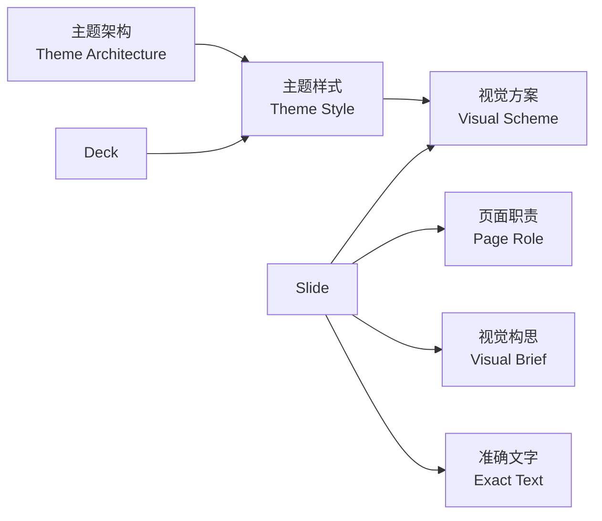

# StoryWeave Imagegen 主题架构规范

状态：草案  
日期：2026-08-15

## 1. 范围与结论

本文规定 `storyweave-imagegen` 的主题目录、Storyboard 主题选择、逐页视觉方案、Prompt 编译和主题 QA。整页生图、`exact_text` 封闭清单、16:9 画布和逐页 Review 继续沿用现有流程。

主题系统分为三个层级：

1. 主题架构规定整套 deck 的视觉组织原则。
2. 主题样式是主题架构下的具体视觉变体。
3. 视觉方案是某个主题样式内部的单页表达配方。

一套 deck 只使用一个主题样式。每页使用一个属于该样式、且与页面职责兼容的视觉方案。视觉方案不在不同主题样式之间做全量交叉组合。

目标目录包含四套主题架构：`editorial`、`systems`、`campaign`、`cinematic`。四套架构现在都各有一个可运行的候选主题样式，并使用独立的三页 showcase 做 golden deck 与图片 QA；通过后才标记为活动主题。

## 2. 当前状态

当前实现与已确认的候选结果没有同步：

- [`image-themes.json`](../skills/storyweave-imagegen/assets/themes/image-themes.json) 仍开放 `business-minimal`、`editorial`、`launch-tech`、`premium-dark` 四个扁平主题。
- [`shortlist.json`](../examples/ai-customer-service-architecture/shortlist.json) 已选择 `editorial` 和白底 `wuming-cyan-circuit`，其余三个版本位于 `_rejected`。
- `launch-tech` 仍把 `wuming-cyan-circuit` 作为别名。前者是深色青蓝舞台，后者是白底青蓝电路，两者不是同一个主题样式。
- 主题记录同时包含 `composition`、`imagery`、`palette` 和 `materials`。其中前两项会与逐页构图发生冲突，当前数据没有区分全局规则和单页规则。
- Storyboard 已有 `role`、`visual_brief` 和 `layout_plan`，并保存用户确认后的视觉方案。Prompt 编译会同时读取架构、样式和页面方案。

本规范先修正领域模型和数据归属，再调整运行代码。旧主题和旧样例保留在归档目录，不作为活动目录的兼容别名。

## 3. 领域模型



关系规则如下：

| 概念 | 归属与约束 |
|---|---|
| 主题架构 | 包含一个或多个主题样式；只表达全局视觉组织原则 |
| 主题样式 | 只属于一个主题架构；一套 deck 只能选一个 |
| 视觉方案 | 只属于一个主题样式；声明支持的页面职责和内容限制 |
| 页面职责 | 描述页面在叙事中的任务，不包含画风和媒介 |
| 视觉构思 | 描述本页具体画什么，不承担可复用的主题规则 |
| 准确文字 | 是成图中的封闭文字清单，优先级高于主题和视觉方案 |

Storyboard 草稿可以先给出推荐视觉方案。普通项目在 `approve` 时必须解析成活动主题样式下的确定方案；`authoring` scope 可以为候选样式生成仅供 golden deck 与 QA 使用的批准数据。两种 scope 产生的 deck 都不允许保留 `auto`、跨主题方案或未知方案。

视觉方案不能作为同一个目录实体跨主题样式共享。主题架构可以提供继承的节奏和空间原则，不同主题样式仍需定义自己的方案。相似方案通过相同页面职责建立对应关系，例如 `editorial-diagram` 和 `system-map` 都可以服务 `process`，但它们是两个独立方案。

ID 作用域如下：主题架构 ID 在目录中全局唯一；主题样式 ID 在所属架构内唯一；视觉方案 ID 在所属样式内唯一。完整引用使用斜杠连接，且在目录中全局唯一：

```text
systems/white-cyan-circuit
systems/white-cyan-circuit/system-map
```

## 4. 目标主题架构

| 主题架构 | 核心表达方式 | 计划主题样式 | 状态 |
|---|---|---|---|
| `editorial` 编辑叙事 | 用出版物节奏组织观点、人物、图片和图解 | `paper-magazine`、`executive-journal` | 第一阶段建立前者候选 |
| `systems` 系统蓝图 | 用节点、路径、分组和空间关系解释系统 | `white-cyan-circuit`、`dark-blueprint` | 第一阶段建立前者候选 |
| `campaign` 品牌传播 | 用强标题、产品主体和传播构图形成商业主视觉 | `bold-poster` | 候选 |
| `cinematic` 影像叙事 | 用镜头、光线和空间建立场景与情绪 | `natural-film` | 候选 |

新增主题架构必须改变空间组织原则、阅读顺序、信息密度策略和跨页节奏。具体字体、颜色、明暗和材质属于主题样式；具体图像媒介和单页构图属于视觉方案。只改变这些下层属性时，不应新增主题架构。

四套主题的职责边界：

- `editorial` 以阅读和观点为主；照片、插画和图解服从出版物版面。
- `systems` 以关系和逻辑为主；节点、连线、分组和技术空间必须清楚。
- `campaign` 以传播和产品为主；主体识别和第一眼冲击力高于信息密度。
- `cinematic` 以场景和镜头为主；氛围可以强，但文字区和事实边界不能让位于画面。

## 5. 当前四套主题的视觉方案

四套候选主题样式共包含 27 个视觉方案。视觉方案的 ID 只在所属主题样式中有意义。Storyboard 预览显示中文名称、摘要、代表图和适用页面，项目数据保存完整引用。

### `editorial/paper-magazine`

| 视觉方案 | 支持的页面职责 | 画面规则 |
|---|---|---|
| `magazine-cover` | `cover`、`section` | 大号衬线标题、非对称图片裁切、无新增文字的期刊式图形标记 |
| `editorial-statement` | `statement`、`quote`、`closing` | 文字主导、低密度、对侧保留安静图像或纸面区域 |
| `documentary-hero` | `image-hero`、`section` | 纪录感照片或用户素材，主体裁切不能侵入文字区 |
| `profile-feature` | `quote`、`image-hero`、`section` | 人物或角色特写与编辑式留白并置；姓名、身份和引文只能来自 `exact_text` |
| `editorial-diagram` | `process`、`data` | 纸面图解、墨线和有限色块；数据与标签只来自确认材料 |
| `comparison-spread` | `two-column`、`comparison` | 两个清楚的阅读区域，允许图片与短文字形成对照 |
| `collage-scene` | `image-hero`、`statement`、`closing` | 拼贴或编辑插画承担隐喻，不添加清单外文字 |

### `systems/white-cyan-circuit`

| 视觉方案 | 支持的页面职责 | 画面规则 |
|---|---|---|
| `keynote-cover` | `cover`、`section`、`closing` | 白色或极浅蓝背景，标题与单一青蓝锚点形成焦点 |
| `system-map` | `process`、`statement`、`data` | 中心节点、分组和有方向的连接线解释系统关系 |
| `circuit-flow` | `process` | 节点沿一条连续路径排列，顺序和回路必须可读；没有确认编号时使用无文字图形标记 |
| `data-overview` | `data` | 清爽图表或数据分组；没有来源的数据不得出现 |
| `comparison-matrix` | `two-column`、`comparison` | 对称或矩阵结构，比较维度和标签保持一致 |
| `signal-quote` | `quote`、`statement`、`closing` | 一条主张或引文配合单一青蓝信号锚点；不补写作者、职位或出处 |
| `ui-concept` | `image-hero`、`statement` | 只生成概念界面；真实产品界面必须使用用户素材 |
| `isometric-space` | `image-hero`、`section`、`closing` | 等距技术空间或轻量建筑示意，避免暗黑霓虹和设备广告 |

### `campaign/bold-poster`

| 视觉方案 | 支持的页面职责 | 画面规则 |
|---|---|---|
| `poster-claim` | `cover`、`statement` | 单一传播主体和中等或大号结论形成第一眼焦点，不添加广告副文案。 |
| `product-studio` | `image-hero`、`section` | 一个产品或服务主体占据画面中心，关系只用确认文字表达。 |
| `campaign-comparison` | `comparison`、`two-column` | 两个等重色块使用同一比较维度，不添加第三选项或伪数据。 |
| `launch-sequence` | `process`、`closing` | 用连续的平面动作或路径表现发布节奏，标签只来自 `exact_text`。 |
| `testimonial-poster` | `quote`、`statement` | 以短句和传播主体并置，不补写姓名、职位或出处。 |
| `product-closeup` | `data`、`image-hero` | 用单一细节或材质表达产品重点；不生成规格、价格或 Logo。 |

### `cinematic/natural-film`

| 视觉方案 | 支持的页面职责 | 画面规则 |
|---|---|---|
| `film-opening` | `cover`、`section` | 宽幅自然光场景建立地点和时间，文字位于低纹理边缘。 |
| `human-moment` | `image-hero`、`quote` | 用匿名人物动作或物件细节承载主张，脸部和文字保持分离。 |
| `quiet-ending` | `closing`、`statement` | 用退场动作、余光或空场收束，不添加结尾 Logo 或行动口号。 |
| `establishing-scene` | `cover`、`image-hero` | 用空间纵深建立连续场景，避免可读招牌和无来源地点信息。 |
| `observational-detail` | `process`、`data` | 用手部、物件或局部光线表达过程状态，不生成伪界面或数字。 |
| `sequence-cut` | `comparison`、`two-column` | 以两个镜头或两个空间作同维度对照，避免电影海报式账单文字。 |

同一页面职责可以有多个视觉方案，但候选必须来自当前主题样式。默认推荐不超过三个；不兼容的视觉方案不出现在候选列表中。

视觉方案自身不能引入可见文字。方案名称、预览摘要、期刊标记、节点编号、图表标签和界面占位字都不是成图文字来源。只有列入 `exact_text` 的内容可以出现在页面中；没有列入时，改用无文字图形标记，或者选择不依赖该文字的方案。`evidence` 只约束事实，不会自动转成可见文字。

### 页面职责与默认方案

页面职责使用封闭枚举。它只描述叙事任务，不决定主题样式或视觉媒介。

| 页面职责 | 定义 |
|---|---|
| `cover` | 建立整套 deck 的标题、中心判断和第一视觉锚点 |
| `section` | 开始一个新的叙事段落 |
| `statement` | 突出一条需要单独停留的判断 |
| `image-hero` | 由一幅主视觉承担主要表达 |
| `two-column` | 并列呈现两组不同内容，不要求形成比较结论 |
| `comparison` | 按相同维度比较两个或多个对象 |
| `process` | 表达步骤、路径、循环或状态变化 |
| `data` | 呈现有来源的数字、图表或定量关系 |
| `quote` | 呈现已经确认的引文及可选出处 |
| `closing` | 收束中心判断或给出已经确认的行动 |

每个活动主题样式必须覆盖全部 10 个页面职责，并为每个职责指定一个 `role_defaults`。候选样式可以在开发中暂时不完整，但缺少任一职责时不能晋升为 `active`。四套候选的默认映射如下：

| 页面职责 | `editorial/paper-magazine` | `systems/white-cyan-circuit` | `campaign/bold-poster` | `cinematic/natural-film` |
|---|---|---|---|---|
| `cover` | `magazine-cover` | `keynote-cover` | `poster-claim` | `film-opening` |
| `section` | `documentary-hero` | `keynote-cover` | `product-studio` | `establishing-scene` |
| `statement` | `editorial-statement` | `signal-quote` | `poster-claim` | `quiet-ending` |
| `image-hero` | `documentary-hero` | `isometric-space` | `product-studio` | `human-moment` |
| `two-column` | `comparison-spread` | `comparison-matrix` | `campaign-comparison` | `sequence-cut` |
| `comparison` | `comparison-spread` | `comparison-matrix` | `campaign-comparison` | `sequence-cut` |
| `process` | `editorial-diagram` | `system-map` | `launch-sequence` | `observational-detail` |
| `data` | `editorial-diagram` | `data-overview` | `product-closeup` | `observational-detail` |
| `quote` | `profile-feature` | `signal-quote` | `testimonial-poster` | `human-moment` |
| `closing` | `editorial-statement` | `keynote-cover` | `launch-sequence` | `quiet-ending` |

## 6. 主题与视觉方案的选择方式

用户不需要在开始时浏览全部 27 个视觉方案。选择分两步完成：

1. 先按主题架构浏览主题样式。每个主题样式显示中文名称、一句话摘要、适用内容、封面图和至少四张代表页缩略图。
2. 选定主题样式后，Storyboard 每页只显示与当前页面职责和 `layout_plan` 兼容的 1 至 3 个视觉方案。每个候选显示中文名称、摘要、代表图和推荐原因，`role_defaults` 作为默认选择。

主题样式的预览必须是 mini-deck，至少包含封面、观点、关系或流程、图片主视觉和结尾。单张封面不能证明一套主题能够处理完整叙事。视觉方案的预览图只说明单页构图，不参与 Prompt 编译。

可发现元数据使用以下字段：

| 对象 | 必填字段 |
|---|---|
| 主题架构 | `label`、`summary`、`status` |
| 主题样式 | `label`、`summary`、`status`、`tags`、`preview.cover`、`preview.gallery` |
| 视觉方案 | `label`、`summary`、`preview_image`、`roles` |

`label` 和 `summary` 面向选择界面，允许本地化；稳定 ID 和完整引用不随展示文字变化。预览路径必须指向 Skill 包内的相对路径，不能依赖本机绝对路径或外部网页。

## 7. Awesome 图片类型映射

Awesome 仓库的分类用于补充主题能力，不直接变成 StoryWeave 的全局主题。

| Awesome 类型 | 首选主题架构 | 可选主题架构 | 处理规则 |
|---|---|---|---|
| UI 与界面 | `systems` | `campaign` | 概念 UI 可以生成；真实产品界面使用用户截图 |
| 图表与信息可视化 | `systems` | `editorial` | 数字、单位、比较维度和来源必须经过确认 |
| 海报与排版 | `campaign` | `editorial` | 海报文字仍受 `exact_text` 约束 |
| 商品与电商 | `campaign` | `cinematic` | 真实商品外观、包装和商标需要用户资产 |
| 品牌与标志 | `campaign` | `editorial` | 不生成或冒充正式 Logo、VI 和品牌规范 |
| 建筑与空间 | `cinematic` | `systems`、`editorial` | 分别用于沉浸场景、空间示意和建筑叙事 |
| 摄影与写实 | `editorial`、`cinematic` | `campaign` | 生成图不能作为真实人物、事件或产品证据 |
| 插画与艺术 | `editorial`、`campaign` | `systems` | `systems` 只使用线性、示意型或技术插画 |
| 人物与角色 | `campaign`、`cinematic` | `editorial` | 版权角色和真实人物需要合法来源素材 |
| 场景与叙事 | `cinematic` | `editorial`、`systems` | `systems` 只处理技术空间和示意场景 |
| 历史与古风 | `editorial`、`cinematic` | 无 | 作为题材标签，不把生成画面当作历史证据 |
| 文档与出版物 | `editorial`、`systems` | 无 | 长文需要压缩；正式文档内容必须来自确认材料 |
| 其他应用场景 | 无 | 无 | 不保留兜底类别，按最终表达方式重新分类 |

## 8. 目录数据与 schema v3

项目文件使用完整引用，不保存容易产生歧义的短 ID：

```text
theme_ref = systems/white-cyan-circuit
visual_scheme_ref = systems/white-cyan-circuit/system-map
```

目录文件内部可以使用局部 ID，因为所属路径已经明确。CLI 参数、Storyboard、批准后的 deck 和 manifest 一律使用完整引用。运行时不接受省略架构的样式 ID，也不接受省略样式的方案 ID。

### 目录元数据与配方

`catalog.json` 是生命周期状态、主题架构与主题样式展示元数据、文件引用的唯一来源。视觉方案的展示元数据保存在所属主题样式文件中。目录包含四套主题架构和四套 `candidate` 样式；候选通过更多 golden deck 与 QA 后，将状态改为 `active`，不改稳定引用。

```json
{
  "schema_version": 3,
  "architectures": [
    {
      "id": "systems",
      "label": "系统蓝图",
      "summary": "用节点、路径和分组解释系统关系",
      "status": "candidate",
      "file": "systems/architecture.json",
      "styles": [
        {
          "ref": "systems/white-cyan-circuit",
          "label": "白底青蓝电路",
          "summary": "白色技术空间中的节点、路径和青蓝信号",
          "status": "candidate",
          "tags": ["技术架构", "系统关系", "浅色"],
          "file": "systems/styles/white-cyan-circuit.json",
          "preview": {
            "cover": "../examples/theme-showcase/systems/white-cyan-circuit/s01.png",
            "gallery": "../examples/theme-showcase/systems/white-cyan-circuit/index.html"
          }
        }
      ]
    },
    {
      "id": "campaign",
      "label": "品牌传播",
      "summary": "用强标题和产品主体形成传播主视觉",
      "status": "candidate",
      "file": "campaign/architecture.json",
      "styles": [
        {
          "ref": "campaign/bold-poster",
          "label": "强传播海报",
          "summary": "用平面色块、产品主体和中等字号主张建立传播焦点",
          "status": "candidate",
          "tags": ["品牌传播", "海报", "产品主体"],
          "file": "campaign/styles/bold-poster.json"
        }
      ]
    }
  ]
}
```

每套架构的 `architecture.json` 保存空间组织、阅读顺序、密度策略和跨页节奏。每个主题样式文件保存字体、色彩、材质、光线、视觉锚点、`role_defaults` 和方案配方。生命周期状态不在配方文件中重复保存。

```json
{
  "schema_version": 3,
  "id": "systems",
  "spatial_grammar": "nodes, paths and explicit groups in a shared technical field",
  "reading_order": "follow the dominant relationship path before secondary branches",
  "density_strategy": "keep one primary system relationship and limit secondary branches",
  "deck_rhythm": "alternate overview, focused relationship and quiet statement pages"
}
```

```json
{
  "schema_version": 3,
  "architecture_id": "systems",
  "id": "white-cyan-circuit",
  "art_direction": "clean white technical keynote with precise cyan system signals",
  "palette": "white, pale blue, cyan, blue-green, deep blue-gray",
  "typography": "clear modern Chinese sans serif",
  "materials": "clean light, fine technical grid, restrained glow",
  "anchors": [
    { "id": "calibration-line", "prompt": "short cyan calibration line" },
    { "id": "connection-node", "prompt": "restrained cyan connection node" }
  ],
  "default_anchor_id": "calibration-line",
  "text_layout": "large conclusion text in a quiet field separated from system detail",
  "contrast": "deep blue-gray text on white or pale blue with no signal line behind letters",
  "avoid": ["dark cyberpunk stage", "decorative pseudo-data", "dense circuit-board wallpaper"],
  "role_defaults": {
    "cover": "keynote-cover",
    "section": "keynote-cover",
    "statement": "signal-quote",
    "image-hero": "isometric-space",
    "two-column": "comparison-matrix",
    "comparison": "comparison-matrix",
    "process": "system-map",
    "data": "data-overview",
    "quote": "signal-quote",
    "closing": "keynote-cover"
  },
  "schemes": {
    "system-map": {
      "label": "系统关系图",
      "summary": "用中心节点、分组和有方向的连线解释关系",
      "preview_image": "../../../examples/theme-showcase/systems/white-cyan-circuit/scheme-system-map.png",
      "roles": ["process", "statement", "data"],
      "default_anchor_id": "connection-node",
      "composition": "one dominant hub with grouped surrounding capabilities",
      "imagery": "linear icons, nodes and directional connectors; labels appear only when supplied by exact_text",
      "layout_constraints": {
        "text_safe_zones": ["left", "top-left", "top"],
        "visual_zones": ["center", "right"],
        "densities": ["low", "medium"]
      },
      "requirements": ["relationship direction must be unambiguous"],
      "avoid": ["serial pipeline when relationships are parallel"]
    }
  }
}
```

### `layout_plan` v3

为了让布局兼容性可以由代码判断，v3 不再使用“right or center-right”一类自由文本作为位置值。`text_safe_zone` 使用单个九宫格位置，`visual_zone` 使用一个或多个九宫格位置，`density` 使用封闭枚举：

```text
zone = top-left | top | top-right | left | center | right | bottom-left | bottom | bottom-right
density = low | medium | high
```

`hierarchy` 是有顺序的非空字符串数组，用于编译页面层级，不参与位置匹配。`text_safe_zone` 不能与 `visual_zone` 重叠；这里的视觉区指主体和高频细节所在区域，不代表背景只能出现在这些格子中。方案兼容性要求文字区、所有视觉区和密度都包含在方案的 `layout_constraints` 中。

`visual_anchor_id` 引用当前主题样式 `anchors` 中的局部 ID。规划器优先使用视觉方案的 `default_anchor_id`，否则使用主题样式的 `default_anchor_id`。`continuity_group` 是 deck 内部的分组 ID，表示哪些页面应继续使用同一个锚点处理；它不引用目录实体。默认情况下，封面属于 `cover`，每个 `section` 开始一个以该页 ID 命名的新组，其他页面沿用前一组；没有章节页的正文统一使用 `main`。用户可以在批准前调整分组。两个字段在批准后的 slide 中必填。

下面三个 JSON 块用于展示主题字段的典型值，省略了与示例无关的内容字段。代码块后的字段表定义 v3 完整契约和必填性，实施时以字段表及对应 JSON Schema 为准。

### `outline_draft` v3 片段

草稿在创建时保存 `theme_ref`。`visual_scheme_ref` 可以是完整引用，也可以是 `auto`；`auto` 表示使用该主题样式在 `role_defaults` 中为当前页面职责指定的方案。`layout_plan` 和 `evidence` 仍是逐页必填字段。

```json
{
  "schema_version": 3,
  "status": "draft",
  "catalog_scope": "active",
  "theme_ref": "systems/white-cyan-circuit",
  "slides": [
    {
      "id": "s01",
      "role": "process",
      "claim": "AI 客服是一条可治理的服务闭环",
      "exact_text": [
        "AI 客服是一条可治理的服务闭环",
        "统一接入",
        "智能编排",
        "知识与工具",
        "模型服务",
        "人工协同",
        "运营治理"
      ],
      "evidence": [],
      "visual_brief": "以智能编排为中心，连接接入、知识、模型、人工和治理能力",
      "visual_scheme_ref": "auto",
      "visual_anchor_id": "connection-node",
      "continuity_group": "main",
      "layout_plan": {
        "text_safe_zone": "top-left",
        "visual_zone": ["center", "right"],
        "hierarchy": ["headline", "system-groups", "relationship-paths"],
        "density": "medium"
      }
    }
  ]
}
```

### `deck_spec` v3 片段

`approve` 根据 `role_defaults` 解析草稿中的 `auto`，验证方案和布局兼容性，再写入完整方案引用。批准后的 deck 不允许出现 `auto`。

```json
{
  "schema_version": 3,
  "status": "approved",
  "catalog_scope": "active",
  "theme_ref": "systems/white-cyan-circuit",
  "slides": [
    {
      "id": "s01",
      "role": "process",
      "claim": "AI 客服是一条可治理的服务闭环",
      "exact_text": [
        "AI 客服是一条可治理的服务闭环",
        "统一接入",
        "智能编排",
        "知识与工具",
        "模型服务",
        "人工协同",
        "运营治理"
      ],
      "evidence": [],
      "visual_brief": "以智能编排为中心，连接接入、知识、模型、人工和治理能力",
      "visual_scheme_ref": "systems/white-cyan-circuit/system-map",
      "visual_anchor_id": "connection-node",
      "continuity_group": "main",
      "layout_plan": {
        "text_safe_zone": "top-left",
        "visual_zone": ["center", "right"],
        "hierarchy": ["headline", "system-groups", "relationship-paths"],
        "density": "medium"
      }
    }
  ]
}
```

### `generation_manifest` v3 片段

manifest 记录完整主题引用、每页完整方案引用和配方 hash。这样可以判断主题文件改变后，旧图片是否仍可复用。

```json
{
  "schema_version": 3,
  "mode": "imagegen",
  "catalog_scope": "active",
  "theme_ref": "systems/white-cyan-circuit",
  "theme_recipe_sha256": "0000000000000000000000000000000000000000000000000000000000000000",
  "deck_spec_sha256": "1111111111111111111111111111111111111111111111111111111111111111",
  "slides": [
    {
      "id": "s01",
      "role": "process",
      "visual_scheme_ref": "systems/white-cyan-circuit/system-map",
      "visual_scheme_sha256": "2222222222222222222222222222222222222222222222222222222222222222",
      "prompt_sha256": "3333333333333333333333333333333333333333333333333333333333333333",
      "output_path": "slides/s01.png",
      "asset_role": "complete-slide",
      "text_policy": "exact-text-in-image",
      "visual_review": "pending"
    }
  ]
}
```

示例 hash 仅用于展示字段格式，实际值均为 64 位小写十六进制 SHA-256。JSON 输入按 RFC 8785 JSON Canonicalization Scheme 编码为 UTF-8。两个配方 hash 的输入对象固定为以下字段，不从原文件整块取值：

```json
{
  "theme_recipe_hash_input": {
    "schema_version": 3,
    "theme_ref": "systems/white-cyan-circuit",
    "architecture": {
      "id": "systems",
      "spatial_grammar": "...",
      "reading_order": "...",
      "density_strategy": "...",
      "deck_rhythm": "..."
    },
    "style": {
      "architecture_id": "systems",
      "id": "white-cyan-circuit",
      "art_direction": "...",
      "palette": "...",
      "typography": "...",
      "materials": "...",
      "anchors": [],
      "default_anchor_id": "calibration-line",
      "text_layout": "...",
      "contrast": "...",
      "avoid": []
    }
  },
  "visual_scheme_hash_input": {
    "schema_version": 3,
    "visual_scheme_ref": "systems/white-cyan-circuit/system-map",
    "roles": ["process", "statement", "data"],
    "default_anchor_id": "connection-node",
    "composition": "...",
    "imagery": "...",
    "title_treatment": {},
    "layout_constraints": {},
    "requirements": [],
    "avoid": []
  }
}
```

`theme_recipe_sha256` 和 `visual_scheme_sha256` 分别对上述两个对象计算。`deck_spec_sha256` 对完整 `deck_spec` 删除顶层 `approved_at` 后计算；v3 deck 不允许其他时间戳字段。`prompt_sha256` 直接对 `imagegen-jobs.jsonl` 中该页最终 `prompt` 的 UTF-8 字节计算，行分隔符固定为 LF，不含 BOM 或末尾换行。它是实际编译结果的指纹，不要求不同版本的编译器生成相同模板；编译结果不同就应产生不同 hash 并让旧图失效。展示元数据不在两个配方输入对象中，因此修改名称或预览图不会让已生成页面失效。

### 完整项目文件契约

以下字段表是 v3 的完整文件契约，不依赖 v2 schema。未列出的字段不得出现，后续扩展必须先修改 schema 版本。

`outline_draft` 与 `deck_spec` 的顶层字段：

| 字段 | 草稿 | 批准后 | 约束 |
|---|---|---|---|
| `schema_version` | 必填 | 必填 | 固定为 `3` |
| `status` | `draft` | `approved` | 封闭枚举 |
| `catalog_scope` | 必填 | 必填 | `active` 或 `authoring` |
| `title` | 必填 | 必填 | 非空字符串 |
| `audience` | 必填 | 必填 | 非空字符串 |
| `purpose` | 必填 | 必填 | 非空字符串 |
| `page_count` | 必填 | 必填 | 正整数，等于 `slides.length` |
| `central_message` | 必填 | 必填 | 非空字符串 |
| `narrative` | 必填 | 必填 | 只含 `opening`、`problem`、`insight`、`method`、`action` 五个非空字符串 |
| `language` | 必填 | 必填 | BCP 47 语言标签，例如 `zh-CN` |
| `canvas` | 必填 | 必填 | 固定为 `16:9` |
| `theme_ref` | 必填 | 必填 | 完整主题引用，状态符合 `catalog_scope` |
| `slides` | 必填 | 必填 | 非空数组，slide ID 唯一 |
| `mode` | 不出现 | 必填 | 固定为 `imagegen` |
| `output_mode` | 不出现 | 必填 | 固定为 `full-slide-image` |
| `approved_at` | 不出现 | 必填 | RFC 3339 时间戳 |

每个 slide 的完整字段：

| 字段 | 必填性与约束 |
|---|---|
| `id` | 必填；匹配 `^[A-Za-z0-9_-]+$`，在 deck 内唯一 |
| `role` | 必填；使用第 5 节的 10 项封闭枚举 |
| `purpose` | 必填；非空字符串 |
| `claim` | 必填；非空字符串 |
| `exact_text` | 必填；至少一个非空字符串，是唯一可见文字来源 |
| `evidence` | 必填；JSON 对象数组，可以为空；主题 Module 将对象视为不透明内容，只检查数组类型 |
| `visual_brief` | 必填；非空字符串，不得作为额外可见文字来源 |
| `visual_scheme_ref` | 必填；草稿允许 `auto` 或完整引用，批准后只允许完整引用 |
| `visual_anchor_id` | 必填；引用当前样式中的锚点 ID |
| `continuity_group` | 必填；deck 内非空分组 ID |
| `layout_plan` | 必填；只含 `text_safe_zone`、`visual_zone`、`hierarchy`、`density`，遵守本节枚举与不重叠规则 |
| `transition` | 必填；非空字符串 |
| `sources` | 可选；JSON 对象数组，主题 Module 不解释对象内部字段 |
| `speaker_notes` | 可选；字符串 |

`generation_manifest` 的顶层字段：

| 字段 | 约束 |
|---|---|
| `schema_version` | 固定为 `3` |
| `title` | 非空字符串，与 deck 一致 |
| `mode` | 固定为 `imagegen` |
| `catalog_scope` | 与 deck 一致 |
| `theme_ref` | 与 deck 一致 |
| `theme_recipe_sha256` | 64 位小写十六进制字符串 |
| `deck_spec_sha256` | 64 位小写十六进制字符串 |
| `provider` | 固定为 `imagegen` |
| `canvas` | 固定为 `16:9` |
| `slides` | 非空数组，数量、ID 和顺序与 deck 一致 |

manifest 中每个 slide 的完整字段：

| 字段 | 约束 |
|---|---|
| `id`、`index`、`role` | 分别与 deck 的 ID、从 1 开始的页序和页面职责一致 |
| `visual_scheme_ref` | 与 deck 中该页的完整引用一致 |
| `visual_scheme_sha256`、`prompt_sha256` | 64 位小写十六进制字符串 |
| `model` | 非空字符串 |
| `size` | `WIDTHxHEIGHT`，必须是 16:9；默认 `2048x1152` |
| `quality` | `low`、`medium`、`high` 或 `auto` |
| `output_path` | 项目内相对路径 |
| `status` | `prepared`、`generated`、`failed`、`pass`、`revise` 或 `unresolved` |
| `attempts` | 大于或等于 0 的整数 |
| `error` | 字符串或 `null` |
| `asset_role` | 固定为 `complete-slide` |
| `text_policy` | 固定为 `exact-text-in-image` |
| `visual_review` | `pending`、`pass` 或 `fail` |
| `review_notes`、`reviewed_at`、`warning` | 可选；分别为字符串或 `null`、RFC 3339 时间戳、字符串 |

三个文件遵守以下状态规则：

- `outline_draft` 可以包含 `auto`，但必须包含有效 `theme_ref`、页面职责、`exact_text`、`evidence`、`visual_brief`、`layout_plan`、`visual_anchor_id` 和 `continuity_group`。
- 普通项目的 `catalog_scope` 固定为 `active`，`deck_spec` 只能引用活动主题样式和其中存在的视觉方案。
- 主题制作流程使用 `catalog_scope: "authoring"`，可以为 `candidate` 生成 golden deck，但仍拒绝 `planned`。这类 deck 和 manifest 只用于预览与 QA，不能作为普通项目交付；主题晋升后必须在 `active` scope 下重新批准。
- `deck_spec` 中的每个 `visual_scheme_ref` 必须以当前 `theme_ref/` 开头，并支持该页职责。
- `generation_manifest` 必须与批准后的 deck、主题配方、方案配方和 `imagegen-jobs.jsonl` 中的实际 Prompt hash 一致；任一项不一致时重新编译 Prompt，不能沿用旧图片的通过状态。
- `planned` 只有可发现元数据，不可解析、批准或生成。

## 9. 主题解析 Module

主题解析集中在一个 in-process Module。CLI 只传入完整 slide 和执行阶段，不自行查目录、拼接引用或解释兼容规则：

```js
const themes = await openThemeCatalog(themeRoot, {
  scope: "active" | "authoring"
});

themes.resolveVisualPlan({
  phase: "draft" | "approve" | "prompt",
  theme_ref,
  slide
});
```

`slide` 是完整的逐页对象，至少包含 `role`、`exact_text`、`evidence`、`visual_brief`、`visual_scheme_ref` 和 `layout_plan`。返回值包含确定的 `theme_ref`、`visual_scheme_ref`、分层 Prompt 片段、基础安全策略和结构化诊断。该函数不修改传入对象。

解析顺序固定：

1. 校验 `theme_ref`、页面职责和逐页必填字段。
2. 读取主题架构、主题样式和目录状态。默认 `active` scope 只允许活动样式；显式 `authoring` scope 允许 `active` 和 `candidate`；`planned` 始终拒绝。
3. 若草稿使用 `auto`，从当前样式的 `role_defaults` 取得唯一默认方案。`approve` 把结果写成完整引用，`prompt` 不接受 `auto`。
4. 若指定完整方案引用，验证它属于当前主题样式，并且支持当前页面职责。
5. 验证方案的 `layout_constraints` 与 `layout_plan`。发生冲突时返回阻塞诊断，不覆盖布局、不静默改选方案。
6. 组合主题架构、主题样式、视觉方案和逐页构思，并附加 Module 自身拥有的文字、证据和素材安全策略。

`auto` 不搜索“看起来最像”的方案，也不在多个候选之间随机选择。若样式缺少当前职责的默认方案，返回阻塞诊断 `catalog.role_default.missing`；若默认方案与自定义布局冲突，Storyboard 显示其他兼容候选，由用户修改方案或布局后再批准。

基础安全策略不存放在单个主题配方中。它至少包括：`exact_text` 封闭清单、禁止额外标签和编号、禁止伪造数据与引用、真实 UI 和品牌资产边界、文字安全区，以及方案展示元数据不得进入 Prompt。

这个 Module 没有远程依赖，不需要 Adapter。`approve`、`prompts`、目录 QA 和测试都通过同一个 interface 验证行为；目录遍历、JSON 合并、完整引用解析和诊断代码留在 implementation 内。

### 切换主题样式

主题样式切换是一次重新规划，不是字段替换。切换操作原子地完成以下处理：

1. 保留标题、受众、目的、中心含义、叙事和页序；逐页保留 `id`、`role`、`purpose`、`claim`、`exact_text`、`evidence`、`visual_brief`、`transition`、`sources` 和 speaker notes。
2. 废弃旧 `visual_scheme_ref`、`layout_plan`、`visual_anchor_id`、`continuity_group` 和已编译 Prompt。
3. 根据新样式的 `role_defaults` 生成新的方案建议、布局计划和跨页锚点，再写入新的 `outline_draft`。
4. 将状态恢复为 `draft`，要求用户重新确认 Storyboard。旧 `deck_spec`、manifest 和图片可以作为历史结果保留，但不得自动复用到新主题。

如果重新规划失败，原项目保持不变并返回诊断。已经批准的 deck 不在原地改主题；切换操作总是产生新的草稿修订。

## 10. Prompt 编译与冲突优先级

Prompt 从宽到窄组合：主题架构、主题样式、视觉方案、逐页构思、布局计划和准确文字。方案与布局先通过兼容性检查，再进入编译。无法兼容时停止批准或生成，不依靠优先级静默覆盖。

| 优先级 | 内容 | 说明 |
|---:|---|---|
| 1 | `exact_text`、证据和安全限制 | 不得被任何视觉规则覆盖 |
| 2 | `layout_plan` | 用户在 Storyboard 中确认的文字区、视觉区和密度 |
| 3 | 视觉方案 | 决定本页构图关系、媒介和主体组织 |
| 4 | 主题样式 | 决定色彩、字体、材质、光线和视觉锚点 |
| 5 | 主题架构 | 决定整套 deck 的空间组织、阅读顺序、密度策略和跨页节奏 |

当前主题记录中的职责需要拆分：

- `palette`、`typography`、`materials`、`anchors`、`text_layout` 和 `contrast` 归入主题样式。
- 可复用的页面节奏和总体密度归入主题架构。
- 具体 `composition`、`imagery`、页面限制和适用职责归入视觉方案。
- `visual_brief` 只保留本页主体和内容关系。

例如 `editorial` 的全局规则可以规定纸张质感和编辑节奏，但不能强制每一页使用纪录摄影。选择 `editorial-diagram` 时，图像媒介应切换为纸面图解，同时保留该主题样式的字体、色彩和印刷处理。

Prompt 编译器只把 `exact_text` 当作可见文字来源。`evidence` 用于限制事实，主题与方案中的 `label`、`summary`、`preview_image` 不进入 Prompt。若某个方案需要 `exact_text` 中不存在的编号、标签、作者或界面文字，解析器应改用无文字图形，或返回阻塞诊断。

## 11. 目录调整

建议目录如下：

```text
skills/storyweave-imagegen/
├── assets/themes/
│   ├── catalog.json
│   ├── editorial/
│   │   ├── architecture.json
│   │   └── styles/
│   │       └── paper-magazine.json
│   ├── campaign/
│   │   └── architecture.json
│   ├── cinematic/
│   │   └── architecture.json
│   └── systems/
│       ├── architecture.json
│       └── styles/
│           └── white-cyan-circuit.json
├── assets/examples/theme-showcase/
│   ├── editorial/paper-magazine/
│   └── systems/white-cyan-circuit/
├── scripts/lib/
│   ├── themes.mjs
│   └── imagegen.mjs
├── schemas/
│   ├── outline_draft.schema.json
│   ├── deck_spec.schema.json
│   └── generation_manifest.schema.json
└── references/
    ├── themes.md
    └── theme-authoring.md
```

`catalog.json` 只负责架构与样式的发现、展示元数据、生命周期状态和文件引用。`architecture.json` 保存架构规则，每个主题样式文件保存样式规则、视觉方案及其展示元数据。`themes.mjs` 隐藏文件布局、加载和兼容性验证；`imagegen.mjs` 只消费已经解析的视觉计划。

主题样例按 `主题架构/主题样式` 保存。一个活动主题样式至少提供封面、观点、关系或流程、图片主视觉和结尾五类代表页，不能只用一张封面证明主题可用。

## 12. 实施、迁移与发布顺序

### 目录状态

| 状态 | 可见性 | 是否可用于普通项目 |
|---|---|---|
| `active` | `themes` 和 `themes --all` | 可以创建草稿、批准和生成 |
| `candidate` | 仅 `themes --all` | 只用于主题制作、golden deck 和 QA |
| `planned` | 仅 `themes --all` | 只有架构或计划元数据，不可解析 |

主题样式状态决定能否选择；主题架构状态是其样式成熟度的汇总。架构下只要有一个 `active` 样式，架构就是 `active`；没有活动样式但有 `candidate` 时是 `candidate`；两者都没有时是 `planned`。目录 QA 检查架构状态与样式状态一致。

当前四套主题样式均保持 `candidate`。现有 v2 主题目录在开发阶段继续服务旧运行代码。只有当四套候选完成更多多页 QA，并且 v3 Module、schema 和迁移工具同时就绪时，才在同一个发布变更中把通过者晋升为 `active` 并切换默认目录。

### 阶段 1：建立候选目录

1. 新增四套主题架构的 `architecture.json` 和 `catalog.json` 元数据。
2. 将现有 `editorial` 整理为候选 `editorial/paper-magazine`。
3. 把白底悟鸣配方整理为原生候选 `systems/white-cyan-circuit`，不再借用深色 `launch-tech`。
4. 为 27 个视觉方案补齐展示元数据、职责、布局限制、禁止项和四套完整 `role_defaults`。

### 阶段 2：建立 Module 与 schema v3

1. 实现目录加载、完整引用解析、状态检查、职责兼容、布局兼容和结构化诊断。
2. 让 `approve` 与 `prompts` 通过同一个 seam 解析主题。
3. 把 `outline_draft`、`deck_spec` 和 `generation_manifest` 升级到 v3。
4. 将创建草稿的命令固定为：

```bash
node scripts/ppt.mjs draft <project-dir> --theme <architecture/style> --title "标题"
```

主题必须在 Storyboard 创建时选定。预览页显示主题样式和每页视觉方案；批准前仍可切换主题，但切换会重新规划全部视觉字段。

### 阶段 3：golden deck 与晋升

1. 四套候选各生成独立的三页 showcase；晋升前再补齐封面、观点、关系、图片主视觉和结尾等页面职责的完整样例。
2. 检查 10 个页面职责的覆盖、跨页一致性、文字准确性、尺寸、主体裁切和对比度。
3. 通过目录 QA、schema 测试和人工 Review 后，把满足条件的样式从 `candidate` 改为 `active`。
4. 同时更新 Skill 包、`references/themes.md`、主题选择页和安装样例。`themes` 只列出活动样式，`themes --all` 还会显示候选项。

### 阶段 4：处理旧目录与项目

1. 从 `launch-tech` 删除错误的 `wuming-cyan-circuit` 别名。
2. 把旧 `image-themes.json`、`business-minimal`、`launch-tech` 和 `premium-dark` 移入可恢复归档，不作为 v3 resolver 的兼容别名。
3. 只迁移 Skill 自带样例。用户项目由用户对明确目录运行一次性迁移命令：

```bash
node scripts/ppt.mjs migrate <project-dir> --to 3 [--language <BCP-47-tag>]
```

`migrate` 只处理传入的单个项目目录，不递归扫描父目录，也不批量寻找其他项目。它先验证全部改写是否确定，再把原文件保存在项目内的 `_migration_backup/v2-<timestamp>/`，最后原子写入 v3 文件；任一引用存在歧义时不修改项目。

即使主题映射确定，v2 项目也不能直接保留 `approved` 状态。v2 没有用户确认的视觉方案，并且旧 `layout_plan` 使用自由文本。迁移工具保留标题、叙事、`claim`、`exact_text`、`evidence`、`visual_brief` 和资料来源，根据新主题重新规划布局，把逐页方案设为 `auto`，并输出需要重新确认的 v3 `outline_draft`。`canvas` 可以按既有产品边界确定为 `16:9`；`language` 若在旧项目中缺失，迁移必须要求调用者提供 `--language`，不能根据文字自动猜测。旧 `deck_spec`、manifest 和图片只保存在备份中；用户重新运行 `approve` 后才会产生新的 v3 deck 和 manifest。

旧 ID 的一次性改写规则如下：

| 旧 ID | 迁移结果 | 处理方式 |
|---|---|---|
| `editorial` | `editorial/paper-magazine` | 确定性改写 |
| `wuming-cyan-circuit` | `systems/white-cyan-circuit` | 仅在项目实际保存该 ID 时确定性改写 |
| `business-minimal` | 无 | 阻止迁移，等待 `editorial/executive-journal` 成为活动样式或由用户另选 |
| `launch-tech` | 无 | 阻止迁移；旧代码会把多个别名归一成该 ID，无法判断原始意图 |
| `premium-dark` | 无 | 阻止迁移，等待 `cinematic/premium-dark` 成为活动样式或由用户另选 |

这些规则只属于显式迁移工具。v3 resolver 不长期接受旧 ID，也不在运行时静默改写。

## 13. 验证与验收

### 目录与 schema

- 当前候选目录包含 `editorial/paper-magazine`、`systems/white-cyan-circuit`、`campaign/bold-poster` 和 `cinematic/natural-film`；`themes --all` 会显示四套候选，普通 `themes` 仍只列出活动样式。
- 主题架构、主题样式和视觉方案 ID 在各自作用域内唯一，所有完整引用和相对文件路径可解析。
- 每个活动主题样式覆盖全部 10 个页面职责，并提供完整 `role_defaults`。
- 每个视觉方案包含 `label`、`summary`、`preview_image`、职责、构图规则、布局限制和禁止项。
- `outline_draft.visual_scheme_ref` 可以是 `auto`；`deck_spec` 和 manifest 的 `visual_scheme_ref` 不允许 `auto`、未知或跨主题方案。

### Prompt 与行为

- Prompt 明确包含架构、主题样式、视觉方案、布局计划和基础安全策略。
- 方案展示元数据不会进入 Prompt，成图文字只来自 `exact_text`。
- 同一视觉方案在同一主题样式中产生稳定的构图语法。
- 方案与页面职责或 `layout_plan` 不兼容时，`approve` 在创建生成任务前失败，并返回可定位的诊断。
- 切换主题样式时保留内容与证据，重新生成方案、布局和视觉锚点，并要求再次确认。
- 正式 UI、商品、品牌、数据和引文页面继续执行素材与事实限制。
- manifest 中任一 deck、主题、方案或 Prompt hash 失配时，旧图片失去可复用资格。

### 视觉样例

- 每套活动主题样式至少有五页代表样例：封面、观点、关系或流程、图片主视觉、结尾。
- 四套 showcase 使用各自匹配的内容场景，以便检查主题差异和场景适配，而不是把同一份文字强行套入所有主题。
- 所有样例通过尺寸、比例、文字、主体裁切、对比度和主题一致性 Review。
- 主题选择页展示整套 mini-deck，不以单张封面代表整个主题。

### 回归测试

- 当前 `storyweave-imagegen` 测试继续通过。
- 新测试覆盖完整引用、状态过滤、10 个页面职责、`auto` 解析、跨主题方案、布局冲突、文字边界、主题切换和 manifest 可复现性。
- 迁移测试覆盖两个确定映射、三个阻塞映射、备份和失败时不写入。
- 测试通过公开 interface 断言结果，不依赖主题文件的内部目录结构。

## 14. 非目标与剩余决策

本次重构不包含以下工作：

- 不把 Awesome 的 13 类直接做成 13 个全局主题。
- 不生成四套主题架构与所有视觉方案的笛卡尔积。
- 不允许一套 deck 在页面之间切换主题样式。
- 不把颜色变体、行业标签或历史题材升级为主题架构。
- 不复制外部仓库的代码、Logo、图片或受版权保护的视觉资产。
- 不改变整页图片交付和对象级不可编辑的产品边界。
- 不在 v3 resolver 中保留长期旧 ID 别名，也不递归迁移用户目录。

`draft --theme <architecture/style>` 和显式 `migrate <project-dir> --to 3` 已经确定。四套首个候选样式名称已经写入目录；后续新增样式仍需先补齐架构、方案、预览和 QA 记录。
