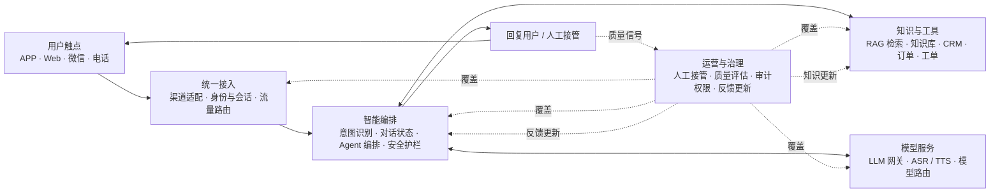

# AI 智能客服架构草稿评审

## 结论

草稿的系统边界基本完整，适合用来测试不同图片主题。主链路是“用户触点 → 统一接入 → 智能编排 → 知识与工具 → 模型服务”，运营与治理作为横向能力覆盖整条链路，质量信号再回流到编排和知识层。

## 当前草稿

## 评审意见

| 维度 | 判断 | 建议 |
|---|---|---|
| 系统边界 | 通过 | 已覆盖渠道、编排、知识、业务工具、模型、人工与治理。 |
| 主链路 | 已调整 | “知识与工具”和“模型服务”不是严格的后置流水线，当前 Storyboard 已改为由“智能编排”并行调用。 |
| 人工协同 | 已调整 | 当前 Storyboard 已单列“人工坐席”，并标明上下文移交，避免只放在底部治理条中。 |
| 数据闭环 | 通过 | 保留“会话与反馈 → 质量评估 → 编排策略 / 知识更新”的回路，但不要把自动更新画成无审核直写。 |
| 安全治理 | 需细化 | “安全护栏”和“审计权限”已有位置。若面向企业客户，可再补充 PII 脱敏、内容安全和工具调用授权。 |
| 可读性 | 有风险 | 单页有 13 条准确文字。生图时要维持大字号，不能继续增加组件；复杂细节应拆到第二页。 |
| 主题适配 | 通过 | `launch-tech` 最适合展示系统流与连接关系；`business-minimal` 更适合正式方案评审。 |

## 建议采用的正式结构

正式架构图建议改为“中心编排 + 四周能力”的拓扑：左侧是用户触点和统一接入，中央是智能编排，右侧并列知识与工具、模型服务，下方单列人工坐席，外围由运营与治理闭环覆盖。这样能避免误读为单向串行流水线，也更符合真实运行关系。

本草稿没有加入 SLA、准确率、解决率或成本等数据。后续如要制作数据页，需要提供业务口径和来源。
