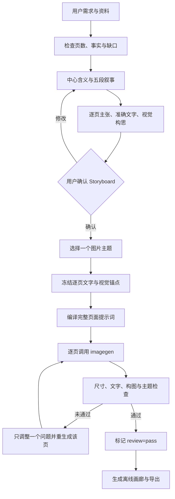

# Imagegen 工作流

Storyboard 是生成门。每页只保留一个主张，`exact_text` 明确列出图片中允许出现的全部文字，`layout_plan` 冻结文字安全区、视觉区、层级和密度。用户未确认前不生成图片；资料缺失时缩短页数或标记 `unresolved`。

图像生成后先检查机器可验证的尺寸、比例和文件完整性，再做逐页视觉复核。复核问题按“文字准确性 → 文字可读性 → 主体与裁切 → 主题一致性 → 页面节奏”顺序处理，每次只改变一个变量。
